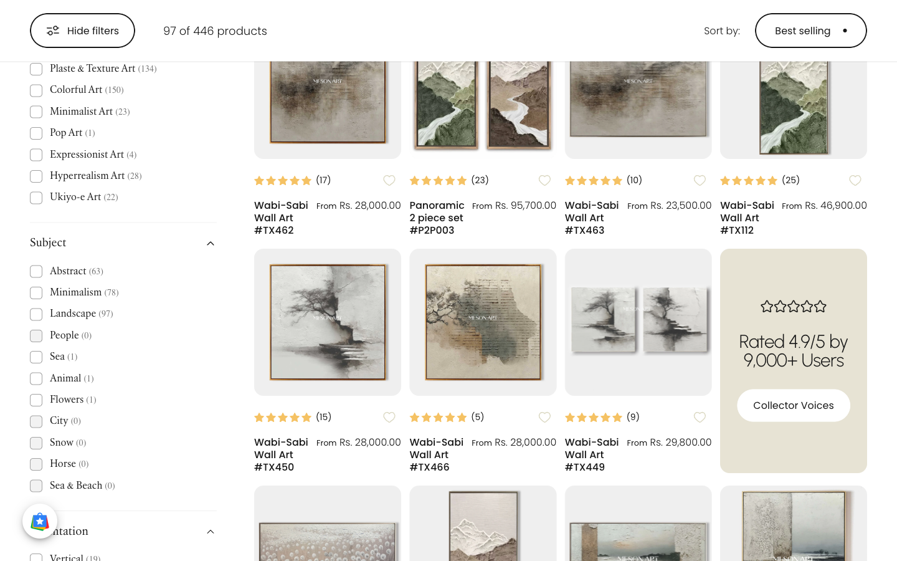
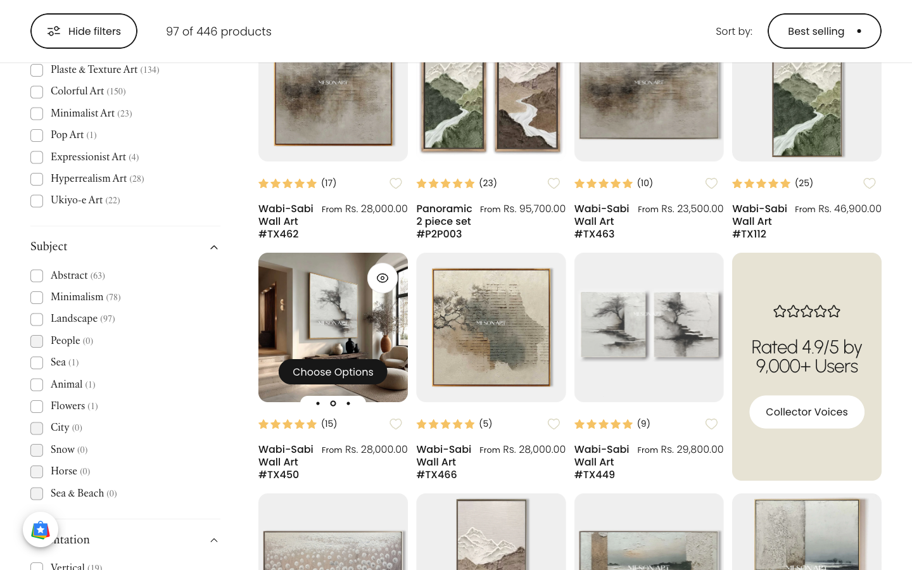
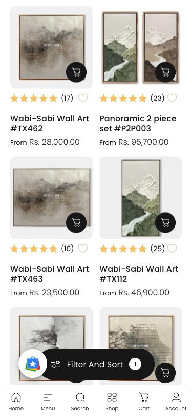

# Reverse-engineering the mesonart.com collection grid

**Target:** `https://www.mesonart.com/collections/landscape-canvas-paitning?filter.p.m.custom.style=Wabi-Sabi+Art`
**Captured:** 2026-07-30, Chromium via Playwright, DPR 1
**Platform:** Shopify. Theme is a Shuja-customised build of a premium theme (custom elements `motion-list`,
`secondary-media`, `lazy-image`, `quick-view`, `gesture-element`; Flickity for the card carousel; Boost AI
Search & Discovery for facets; Loox for reviews; a `wishlist-engine` app).

Everything below is a real measured/quoted value, not an inference, unless explicitly marked **(inferred)**.

---

## 1. The alignment strategy, in one paragraph

Rows line up because **nothing in the card is allowed to derive its height from image content**. Exactly one
`` per card sits in normal flow — the direct child of the `<a class="media media--square">` — and CSS gives
it `aspect-ratio: 1 / 1; width: 100%; object-fit: cover`. That single element *is* the media box's height, so
every media box is a perfect square equal to the grid column width, computed before any byte of image data
arrives (zero CLS). Every other image — all the hover slides — lives inside `.media--height` wrappers that are
`position: absolute; inset: 0; width: 100%; height: 100%`, so they paint over that square and can never
contribute height. The source assets reinforce this: MesonArt pre-composites virtually every primary product
photo as a **square mockup** (1500×1500, 2048×2048, 3200×3200 …) with the framed artwork — portrait, landscape,
or 2-panel — floated on a light `#fafafa` matte, so the "different aspect ratios" problem is solved in
Photoshop, not in CSS; `object-fit: cover` is only the safety net for the ~6% of *secondary* images that are
genuinely off-ratio (3000×4000, 2976×3444). Finally, the *text* block is **not** height-locked — titles wrap to
3 or 4 lines and card heights genuinely differ (359.88 / 376.88 / 379.88 px) — but that doesn't matter, because
`display: grid` with `align-items: stretch` (the default) sizes each grid row to its tallest card and stretches
the other three to match. Measured: **within every row all four cards are byte-identical in height; between
rows they differ.** The grid, not the card, does the aligning.

> The corollary for your rebuild: you do **not** need `min-height` / `line-clamp` on the text block to get
> tidy rows. You need (a) a fixed-ratio media box and (b) a real CSS Grid parent. Line-clamping is a
> *typographic* choice, not an alignment mechanism.

---

## 2. Screenshots

### At rest — 1440 × 900, 4 columns



Note the square media boxes on `#fafafa`, containing artworks of clearly different orientations
(`#TX462` portrait, `#P2P003` two-panel wide, `#TX463` landscape, `#TX112` tall portrait). The tan
"Rated 4.9/5" tile is an injected `.product-card--promo` Shopify app block occupying one grid cell and
stretched to the row height.

### Mid-hover — same viewport, cursor at x ≈ 50% of card `#TX450`



`#TX450` has swapped to its 3rd media (a lifestyle room shot). Appearing: an eye/quick-view button
top-right, a "Choose Options" pill bottom-centre, and 3 page dots below the image (4 dots exist; the
first is `display: none`). Card rect before hover `[408, 399.68, 235.88, 359.88]`; during hover
`[408, 399.68, 235.88, 359.88]` — **pixel-identical, zero reflow.**

### Mobile — 375 × 812, 2 columns



Same square ratio. The hover carousel is `display: none`; the in-flow primary image becomes visible; the
quick-add becomes a permanently-visible cart-icon button; title stacks above price (`flex-col` under `lg`).

---

## 3. Annotated DOM skeleton of one card

Real class names, noise (SVG paths, the whole `<quick-view>` drawer, `srcset` values, Loox/wishlist app
markup) stripped. This is card 1 = *Wabi-Sabi Wall Art #TX462*.

```html
<!-- grid container -->
<motion-list class="card-grid card-grid--4 mobile:card-grid--2 grid relative">

  <div class="card product-card shuja-card-product product-card--standard flex flex-col leading-none relative"
       style="--motion-translateY: 0px; opacity: 1; visibility: visible;">   <!-- ← set by motion-list JS -->

    <div class="product-card__media relative h-auto">

      <button class="quick-view__button button button--secondary z-2 absolute top-0 right-0 opacity-0"
              is="hover-button" aria-controls="Quickview-…-9903088369968">…</button>
      <quick-view id="Quickview-…-9903088369968" class="quick-view x-modal drawer z-40 fixed …" hidden>…</quick-view>
      <div class="badges z-2 absolute grid gap-3 pointer-events-none"></div>

      <!-- ★ THE ASPECT-RATIO ANCHOR: media--square, position:relative, bg #fafafa -->
      <a class="block relative media media--square" href="/collections/…/products/wabi-sabi-wall-art-tx462"
         aria-label="Wabi-Sabi Wall Art #TX462" tabindex="-1">

        <!-- ① inert until hydration: 4 slides, ZERO network requests while in here -->
        <template>
          <div class="media media--height w-full h-full overflow-hidden">
            
          </div>
          <div class="media media--height …"></div>
          <div class="media media--height …"></div>
          <div class="media media--height …"></div>
        </template>

        <!-- ② hydrated by JS on inView(margin 200px); Flickity wraps the cloned slides -->
        <secondary-media class="product-card__carousel block absolute top-0 left-0 w-full h-full
                                hidden md:block flickity-enabled"
                         selected-index="0" muted>
          <div class="flickity-viewport" style="height: 235.875px;">
            <div class="flickity-slider" style="transform: translateX(0%);">
              <div class="media media--height w-full h-full overflow-hidden flickity-cell is-selected"
                   style="transform: translateX(0%);">    </div>
              <div class="… flickity-cell" aria-hidden="true" style="transform: translateX(100%);">…</div>
              <div class="… flickity-cell" aria-hidden="true" style="transform: translateX(200%);">…</div>
              <div class="… flickity-cell" aria-hidden="true" style="transform: translateX(300%);">…</div>
            </div>
          </div>
          <div class="flickity-page-dots">
            <button class="flickity-page-dot is-selected" aria-label="View slide 1"></button>  <!-- display:none -->
            <button class="flickity-page-dot" aria-label="View slide 2"></button>
            <button class="flickity-page-dot" aria-label="View slide 3"></button>
            <button class="flickity-page-dot" aria-label="View slide 4"></button>
          </div>
        </secondary-media>

        <!-- ③ ★ THE HEIGHT SPACER + no-JS/mobile fallback.
                 In normal flow, aspect-ratio:1/1 → defines the square.
                 On desktop it is opacity:0; visibility:hidden. loading="eager" for row 1. -->
        
      </a>

      <div class="quick-add flex justify-end md:justify-center absolute w-full z-1 pointer-events-none">
        <button class="button button--primary pointer-events-auto md:opacity-0" is="hover-button"
                aria-controls="Quickview-…" aria-label="Choose options">
          <span class="btn-fill"></span>
          <span class="btn-text"><svg class="icon icon-cart icon-sm md:hidden">…</svg>
                                 <span class="hidden md:block">Choose options</span></span>
        </button>
      </div>
    </div><!-- /.product-card__media -->

    <div class="product-card__content grow flex flex-col justify-start text-left w-full">
      <div class="loomx-hieghtx">        <!-- app-injected rating + wishlist row; NO fixed height -->
        <div class="loox-rating" data-rating="4.9" data-raters="17">…</div>
        <div class="wishlist-engine" data-product_id="9903088369968">…</div>
      </div>
      <div class="product-card__details flex flex-col lg:flex-row items-baseline gap-2 w-full h-full">
        <p class="grow">
          <a class="product-card__title reversed-link text-base-xl font-medium leading-tight" href="…">
            Wabi-Sabi Wall Art #TX462</a>
        </p>
        <div class="flex flex-col gap-2">
          <div class="price flex flex-wrap lg:flex-col lg:items-end gap-2 md:gap-1d5">
            <span class="price__regular whitespace-nowrap"><small>From</small> Rs. 28,000.00</span>
          </div>
        </div>
      </div>
    </div>
  </div><!-- /.product-card -->
  …
</motion-list>
```

**Measured box model at 1440px** (`.card-grid` = 984px wide because of the 300–390px facet sidebar):

| element | width | height |
|---|---|---|
| `motion-list.card-grid` | 984 | 10035.75 (all 104 cards) |
| `.product-card` | 235.875 | 359.875 |
| `.product-card__media` | 235.875 | 235.875 |
| `a.media.media--square` | 235.875 | 235.875 |
| `img` (in-flow spacer) | 235.875 | 235.875 |
| `secondary-media` (abs) | 235.875 | 235.875 |
| `.product-card__content` | 235.875 | 124 |
| `.product-card__details` | 235.875 | 60 (+ 11px margin-top) |

---

## 4. The key CSS, as real declarations

### 4a. Grid container

```css
.card-grid {
  --card-grid-per-row: 2;
  --card-grid-template: auto-flow dense / repeat(var(--card-grid-per-row), minmax(0, 1fr));
  --card-grid-gap: var(--sp-3);              /* 0.75rem */
  grid: var(--card-grid-template);           /* shorthand → display:grid + auto-flow row dense + columns */
  gap: var(--card-grid-gap);
}
@media screen and (min-width: 768px) {
  .card-grid { --card-grid-per-row: 3;
               --card-grid-gap: clamp(var(--sp-4), 1.263vw, var(--sp-6)); }  /* clamp(1rem, 1.263vw, 1.5rem) */
}
@media screen and (min-width: 1280px) {
  .card-grid--4, .card-grid--5 { --card-grid-per-row: 4 !important; }
}
@media screen and (min-width: 1536px) { .card-grid--5 { --card-grid-per-row: 5; } }
/* would drop this collection to 3-up, but loses to the !important above */
@media screen and (min-width: 1280px) {
  .collection.with-sidebar :is(.card-grid--4, .card-grid--5) { --card-grid-per-row: 3; }
}
/* store-specific hard override — this is what actually produces the observed gap */
.cc-box23 .card-grid { gap: 20px 13.5px !important; }
```

Note `auto-flow **dense**` — it back-fills holes left by the multi-cell `.product-card--promo` app blocks
(`grid-column: span var(--card-column-size)`).

**Measured at each breakpoint** (the sidebar is present ≥1280; `gap` is pinned by the `!important` override at
every width, so `--card-grid-gap` is decorative here):

| viewport | `grid-template-columns` | cols | row-gap | col-gap | card W | media box H | `secondary-media` |
|---|---|---|---|---|---|---|---|
| 1536 | `258.07px ×4` | 4 | 20px | 13.5px | 258.1 | 258.1 | `block` |
| 1440 | `235.875px ×4` | 4 | 20px | 13.5px | 235.9 | 235.9 | `block` |
| 1280 | `195.875px ×4` | 4 | 20px | 13.5px | 195.9 | 195.9 | `block` |
| 1024 | `308.33px ×3` | 3 | 20px | 13.5px | 308.3 | 308.3 | `block` |
| 768  | `233.66px ×3` | 3 | 20px | 13.5px | 233.7 | 233.7 | `block` |
| 640  | `293.25px ×2` | 2 | 20px | 13.5px | 293.3 | 293.3 | **`none`** |
| 375  | `160.75px ×2` | 2 | 20px | 13.5px | 160.8 | 160.8 | **`none`** |

`media box H == card W` at every single width → the square never breaks.

### 4b. The ratio system (this is the whole trick)

```css
.media                { background-color: rgb(var(--color-placeholder)); }   /* → rgb(250 250 250) */
.media--transparent:not(.loading) { background-color: transparent; }
.media > img          { backface-visibility: hidden; object-fit: cover; object-position: center center; }

/* ratio is declared on the CHILD img, not the wrapper */
.media--rounded   > :is(img, svg, video-media),
.media--square    > :is(img, svg, video-media), .aspect-square    { aspect-ratio: 1 / 1;  }
.media--portrait  > :is(img, svg, video-media), .aspect-portrait  { aspect-ratio: 4 / 5;  }
.media--landscape > :is(img, svg, video-media), .aspect-landscape { aspect-ratio: 4 / 3;  }
.media--wide      > :is(img, svg, video-media), .aspect-wide      { aspect-ratio: 16 / 9; }

/* overlay layers: fill, never contribute height */
.media--height > :is(img, svg, video-media) {
  inset: 0; position: absolute; max-width: 100%; width: 100%; height: 100%;
}

.media--contain > img { object-fit: contain; }   /* exists in the theme, NOT used on this collection */

@media screen and (pointer: fine) {
  .media > img { transition-property: opacity, transform; }   /* duration/easing come from the shorthand below */
}
```

No `padding-top: 100%` hack anywhere, and no `aspect-ratio` on the wrapper — verified: `a.media` computes
`aspect-ratio: auto; padding-top: 0px; height: 235.875px`. The height is purely the in-flow child's.

### 4c. Card, media wrapper, radius

```css
.product-card {
  --product-card-quick-view-inset: var(--sp-4);                  /* 16px */
  background-color: rgb(var(--color-placeholder));
  border-radius: var(--card-radius);                             /* clamp(0.625rem, 1.053vw, 1.25rem) */
  align-content: flex-start;
  border: var(--card-border-width) solid rgb(var(--color-foreground) / var(--border-opacity));
  box-shadow: var(--shadow-horizontal-offset) var(--shadow-vertical-offset)
              rgb(var(--color-shadow) / var(--shadow-opacity));
}
.product-card--standard { background-color: transparent; }
.product-card--standard .product-card__media :is(.media, .flickity-viewport, .product-card__model) {
  border-radius: var(--card-radius);
}
.product-card__content {
  --card-content-padding-block:  clamp(var(--sp-4), 1.263vw, var(--sp-6))
                                 clamp(var(--sp-4), 2.105vw, var(--sp-10));
  --card-content-padding-inline: clamp(var(--sp-4), 2.105vw, var(--sp-10));
  grid-template-columns: minmax(0, 1fr);
  padding-block: var(--card-content-padding-block);
  padding-inline: var(--card-content-padding-inline);
}
.product-card--standard:not(.product-card--thickness) .product-card__content { padding-inline: 0; }
.product-card__content { padding: 0 !important; }                /* store override — kills all of the above */
.custom-collection .product-card__details { margin: 11px 0 0; }
.custom-collection a.product-card__title  { text-align: center; width: 100%; font-size: 16px !important; }
```

There is **no** `min-height`, no `-webkit-line-clamp`, and no fixed row count on the title or the
`.loomx-hieghtx` rating row. Measured: `min-height: auto`, `-webkit-line-clamp: none`,
`overflow: visible`, `font-size: 16px`, `line-height: 20px`, and titles rendering at **3 or 4 line boxes**
depending on the product name.

### 4d. Hover / carousel layer

```css
@media screen and (min-width: 768px) {
  .product-card__carousel > .media { position: absolute; }
  .product-card__carousel.flickity-enabled .flickity-viewport { cursor: unset; height: 100% !important; }

  /* ★ hides the in-flow spacer img on desktop — general sibling of the carousel */
  .js .product-card__carousel ~ img { opacity: 0; visibility: hidden; pointer-events: none; }
  .no-js .product-card__carousel { display: none; }

  .product-card__carousel .flickity-page-dots {
    --tw-translate-y: var(--sp-2);      /* 8px */
    --tw-translate-x: -50%;
    position: absolute; inset-block-end: calc(var(--sp-3d5) * -1); inset-inline-start: 50%;
    visibility: hidden; opacity: 0; margin: 0;
    border-radius: var(--rounded-full); background-color: rgb(var(--color-placeholder));
    height: var(--sp-6); padding-inline: var(--sp-4); width: auto;
    transform: translate(calc(var(--tw-translate-x) * var(--transform-logical)), var(--tw-translate-y));
    transition-property: opacity, visibility, transform;
    pointer-events: none;
  }
  .product-card--standard .product-card__carousel .flickity-page-dots {
    background-color: rgb(var(--color-background));
  }
  /* first dot hidden — slide 0 is the "not hovered" state, so it gets no dot */
  .product-card__carousel .flickity-page-dot:first-child,
  .product-card__carousel.without-dots .flickity-page-dots { display: none; }
}

@media screen and (pointer: fine) {
  .product-card__carousel { transition: opacity var(--animation-primary); }
  .product-card__carousel:hover .flickity-page-dots {
    --tw-translate-y: 0; opacity: 1; visibility: visible;
  }
  /* 1.05 zoom — targets the DIRECT .media child only, i.e. the spacer img.
     On desktop that img is visibility:hidden, so this zoom is INERT here. */
  .product-card__media > .media > img,
  .product-card__model > img              { --tw-scale-x: 1;    --tw-scale-y: 1;
                                            transform: scaleX(var(--tw-scale-x)) scaleY(var(--tw-scale-y)); }
  .product-card__media:hover > .media > img,
  .product-card__media:hover .product-card__model > img { --tw-scale-x: 1.05; --tw-scale-y: 1.05; }

  .product-card:hover .quick-add                        { --tw-translate-y: 0; }
  .product-card:hover .quick-add :is(.buttons, .button)  { opacity: 1; }
  .product-card:hover .quick-view__button                { opacity: 1; }
  .js .product-card:hover .quick-view__button ~ .product-card__rating { opacity: 0; }
}

@media screen and (max-width: 767px) { .product-card__media > .media { overflow: hidden; } }
```

### 4e. Timing tokens

```css
:root {
  --animation-primary: .5s cubic-bezier(.3, 1, .3, 1);
  --animation-fast:    .3s cubic-bezier(.7, 0, .3, 1);
  --color-placeholder: 250 250 250;
  --card-radius:       clamp(0.625rem, 1.053vw, 1.25rem);   /* 10px → 20px */
  --sp-3: 0.75rem; --sp-4: 1rem; --sp-6: 1.5rem;
  --page-width: 1600px;
  --facets-width: clamp(300px, 20vw, 390px);
}
```

Resolved **computed** transitions actually running on the card:

| element | computed `transition` |
|---|---|
| `img` (both spacer and cell) | `opacity .5s cubic-bezier(.3,1,.3,1), transform .5s cubic-bezier(.3,1,.3,1)` |
| `secondary-media` | `opacity .5s cubic-bezier(.3,1,.3,1)` |
| `.flickity-page-dots` | `opacity .5s …, visibility .5s …, transform .5s cubic-bezier(.3,1,.3,1)` |
| `.quick-add` (wrapper) | `opacity .5s …, transform .5s cubic-bezier(.3,1,.3,1)` |
| `.quick-add .button`, `.quick-view__button` | `box-shadow .5s cubic-bezier(.3,1,.3,1), opacity .3s cubic-bezier(.7,0,.3,1)` |

Flickity's own slide movement is **not** a CSS transition — it's a JS spring on
`.flickity-slider { transform: translateX(-N%) }` (intermediate frames observed as
`translate3d(-99.38%, 0px, 0px)`, `translate3d(-199.49%, …)`).

### 4f. Custom properties in play

Set on `.card-grid` / `.product-card` (from the theme stylesheet, not inline):

| property | value @1440 | purpose |
|---|---|---|
| `--card-grid-per-row` | `4` | column count, flipped per breakpoint |
| `--card-grid-template` | `auto-flow dense/repeat(4, minmax(0, 1fr))` | fed to `grid:` shorthand |
| `--card-grid-gap` | `clamp(1rem, 1.263vw, 1.5rem)` | overridden by `.cc-box23` |
| `--card-radius` / `--rounded-card` | `clamp(0.625rem, 1.053vw, 1.25rem)` | media + card corners |
| `--color-placeholder` | `250 250 250` | the matte behind every image |
| `--product-card-quick-view-inset` | `1rem` | eye-button offset |
| `--card-column-size` / `--card-row-size` | `1` | promo-block cell span |
| `--ratio-percent` | `56.25%` | legacy 16:9 padding hack, **not used by these cards** |
| `--motion-translateY` | `0px` **(inline)** | written by `motion-list` entrance animation |

**Inline styles** on the card are only `--motion-translateY`, `opacity`, `visibility` (entrance animation),
and on Flickity's internals `height: 235.875px` on `.flickity-viewport` and `transform: translateX(N%)` on
`.flickity-slider` / each `.flickity-cell`.

---

## 5. The hover interaction as a state machine

The whole behaviour is one custom element. Here is its **actual deminified source**, pulled live via
`customElements.get('secondary-media').toString()`:

```js
class SecondaryMedia extends HTMLElement {
  constructor() {
    super();
    // hydrate only when within 200px of the viewport
    Motion.inView(this, () => { setTimeout(() => this.init()) },
                  { margin: "200px 0px 200px 0px" });
  }
  get template() { return this.previousElementSibling }        // the sibling <template>
  static get observedAttributes() { return ["selected-index"] }
  get selectedIndex() { return parseInt(this.getAttribute("selected-index")) || 0 }
  set selectedIndex(index) {
    this.setAttribute("selected-index",
      Math.min(Math.max(index, 0), this.items.length - 1).toString());
  }
  disconnectedCallback() { this.carousel && this.carousel.destroy() }

  init() {
    this.appendChild(this.template.content.cloneNode(true));   // ← slides go live here
    this.mediaCount = this.querySelectorAll(".media").length;
    this.items = Array.from(this.children);
    if (this.mediaCount > 1) {
      this.carousel = new Flickity(this, {
        accessibility: false, draggable: false, pageDots: true,
        prevNextButtons: false, wrapAround: true, rightToLeft: theme.config.rtl
      });
      if (this.mediaCount === 2) this.classList.add("without-dots");
      this.addEventListener("mousemove",  this.onMoveHandler);
      this.addEventListener("mouseleave", this.onLeaveHandler);
      this.carousel.on("change", this.onChange.bind(this));
    }
  }

  onMoveHandler(event) {                                        // ← POSITIONAL SCRUB
    if (this.mediaCount === 2) return this.carousel.select(1);
    const { width } = this.carousel.size;
    const mouseX = event.clientX - this.getBoundingClientRect().left;
    if (this.mediaCount === 3)
      return mouseX < width / 2 ? this.carousel.select(1) : this.carousel.select(2);
    if (this.mediaCount === 4)
      return mouseX < width / 3       ? this.carousel.select(1)
           : mouseX < 2 * width / 3   ? this.carousel.select(2)
           :                            this.carousel.select(3);
    // NOTE: 5+ media → falls through, does nothing. See gotchas.
  }
  onLeaveHandler() { this.carousel.select(0) }
  onChange() { this.selectedIndex = this.carousel.selectedIndex }

  attributeChangedCallback(name, oldValue, newValue) {
    if (name === "selected-index" && oldValue !== null && oldValue !== newValue) {
      const fromElement = this.items[parseInt(oldValue)];
      const toElement   = this.items[parseInt(newValue)];
      if (fromElement.tagName === "VIDEO-MEDIA") fromElement?.pause();
      if (toElement.tagName === "VIDEO-MEDIA") {
        if (this.hasAttribute("muted")) {
          const video = toElement?.querySelector("video");
          if (video) video.muted = true;
          toElement?.setAttribute("autoplay", "");
        }
        toElement?.play();
      }
    }
  }
}
```

### States

```
┌──────────────────────────────────────────────────────────────────────────────────────┐
│ S0  DEHYDRATED  (card > 200px from viewport)                                         │
│     DOM:   1 live  (the spacer) + 4 slides inert inside <template>              │
│     Paint: #fafafa only — the spacer is opacity:0;visibility:hidden at ≥768px         │
│     Net:   0 requests for slides 2-4                                                  │
└──────────────────────────────────────────────────────────────────────────────────────┘
        │  Motion.inView fires (200px root margin)  →  init()
        ▼
┌──────────────────────────────────────────────────────────────────────────────────────┐
│ S1  REST  (hydrated, not hovered)         selected-index="0"                          │
│     .flickity-slider  transform: translateX(0%)                                       │
│     cell[0].is-selected;  cells 1-3 at translateX(100/200/300%)                        │
│     .flickity-page-dots  opacity 0 · visibility hidden · translate(-50%, 8px)          │
│     .quick-view__button  opacity 0                                                     │
│     .quick-add           transform translateY(8px);  .button opacity 0                 │
│     spacer          opacity 0 · visibility hidden  (desktop only)                 │
└──────────────────────────────────────────────────────────────────────────────────────┘
        │  mouseenter/mousemove over <secondary-media>        │  mouseleave
        ▼                                                     ▲
┌──────────────────────────────────────────────────────────────────────────────────────┐
│ S2  HOVER  — index chosen by CURSOR X, never by time                                  │
│     4 media:  x <  W/3       → select(1)                                              │
│               W/3 ≤ x < 2W/3 → select(2)                                              │
│               x ≥ 2W/3       → select(3)                                              │
│     3 media:  x < W/2 → select(1) else select(2)                                      │
│     2 media:  always select(1)  (+ .without-dots, dots hidden entirely)                │
│                                                                                        │
│     Slide 0 is UNREACHABLE while hovering — hovering always shows a *different* image.  │
│     Movement: Flickity JS spring on .flickity-slider transform (not a CSS transition)   │
│     Simultaneously, in CSS:                                                            │
│       dots        → opacity 1, visibility visible, translateY 8px→0   (.5s cb(.3,1,.3,1))│
│       quick-view  → opacity 0→1                                       (.3s cb(.7,0,.3,1))│
│       quick-add   → translateY 8px→0 (.5s) + .button opacity 0→1      (.3s)             │
│       rating chip → opacity 1→0                                       (.3s)             │
│     If the target cell is a <video-media>: previous pauses, target autoplays muted.    │
│     Card rect UNCHANGED. Nothing reflows.                                              │
└──────────────────────────────────────────────────────────────────────────────────────┘
        │  mouseleave  →  onLeaveHandler() → carousel.select(0)  →  back to S1
```

### Measured scrub map (card with 4 media, entering fresh from outside each time)

| cursor x (fraction of card width) | resulting `selected-index` |
|---|---|
| off card | `0` |
| 0.02 · 0.10 · 0.20 | `1` |
| 0.35 · 0.50 · 0.65 | `2` |
| 0.80 · 0.98 | `3` |

Boundaries land between 0.20/0.35 and 0.65/0.80 → consistent with the `W/3` and `2W/3` thresholds in the
source. Vertical cursor position is irrelevant. **Not** a timer: holding still at one x for 5.6s kept
`selected-index="2"` and `translateX(-200.01%)` frozen across 14 polls.

### Affordances that appear on hover — the full list

| affordance | at rest | on hover |
|---|---|---|
| second/third/fourth image | hidden behind slide 0 | shown, picked by cursor x |
| page dots (`.flickity-page-dots`) | `opacity 0`, `visibility hidden` | `opacity 1`, `visibility visible`, slides up 8px. Pill on `--color-background`, `height 24px`, `inset-block-end: -14px`. **N−1 dots** (first is `display:none`) |
| quick-view eye button (top-right, inset 16px) | `opacity 0` | `opacity 1` |
| "Choose options" pill (bottom-centre) | `opacity 0` + `translateY(8px)` | `opacity 1` + `translateY(0)` |
| Loox rating chip `.product-card__rating` | visible | fades to `opacity 0` (only when a quick-view button precedes it) |
| 1.05 image zoom | declared | **inert on desktop** (targets the hidden spacer img) |
| colour/size swatches, "N more" thumbs | — | none on this collection |
| card footprint | `[408, 399.68, 235.88, 359.88]` | `[408, 399.68, 235.88, 359.88]` — identical |

### How many images exist vs. are fetched

Measured on a cold load at 1440×900, before any scrolling:

| card index (row) | hydrated? | `` elements live in card | slides still in `<template>` |
|---|---|---|---|
| 0, 1 (row 1, in viewport) | yes | **5** (4 cells + spacer) | 4 (the template is kept) |
| 4 (row 2, y≈1355) | no | **1** (spacer only) | 4 |
| 12 (y≈2115) | no | **1** | 4 |
| 30 (y≈3634) | no | **1** | 4 |

So: 4 slides are *server-rendered as markup* into every card, but they are parked in `<template>`, whose
content is inert — **no image requests** until `Motion.inView` clones it. First paint requests one image per
card. The page starts with 52 cards (48 products + 4 promo blocks) and appends a second batch on scroll
(→ 104 children).

---

## 6. Off-ratio handling — measured, not guessed

Two separate mechanisms, and the important one is not CSS.

**(a) The assets are pre-composited squares.** Every `` carries `width`/`height` attributes equal to the
true master dimensions. Across the 92 product-card images on the page the distinct values are:

```
1500x1500  2048x2048  1024x1024  2000x2000  3200x3200  1130x1130
1254x1254  1944x1944  1600x1600   500x500          ← square masters (86 of 92)
3000x4000  2976x3444   480x360                     ← non-square (6 of 92)
```

Every one of the 6 non-square images is a **secondary/hover slide** — verified by inspecting its parent:
`.media.media--height…flickity-cell`, `position: absolute`. `3000x4000` / `2976x3444` are studio shots,
`480x360` is a YouTube `hqdefault` poster for a `<video-media>` cell. **The in-flow primary image of every
product is square.** The visible consequence is exactly what the screenshots show: the framed artwork —
portrait, landscape, or a two-panel diptych — is composited onto a light `#fafafa` field inside a square
canvas, with its own generous margins baked in.

**(b) `object-fit: cover` is the fallback, and it center-crops.** For the off-ratio secondaries the computed
style is `object-fit: cover; object-position: 50% 50%` inside a square box, so a 3000×4000 portrait loses
~25% top and bottom. Nothing is letterboxed — `.media--contain > img { object-fit: contain }` exists in the
theme but is **not applied** to this collection. The `#fafafa` you see is `.media`'s background, which only
shows through while loading (or if an image fails) — not as a mat under a contained image.

**(c) There is NO server-side crop.** Every CDN URL on the page uses only two query params:

```
//www.mesonart.com/cdn/shop/files/1_1_3_31ea6175-….jpg?v=1752650891&width=1500
```

Surveying all 100 images in the grid, the set of `src` params is exactly `{v, width}` and the set of `srcset`
params is exactly `{v, width}`. **Zero occurrences of `crop=`, `height=`, or `&pad_color=`.** Shopify is doing
pure proportional resizing. So they are *not* using `?width=600&height=600&crop=center` to force squares —
they are relying on square uploads plus CSS `cover`.

Widths offered: `180w 360w 540w 720w 900w 1080w`, with `src` requesting `width=1500`.

---

## 7. CLS / space reservation

No layout shift, by three independent guards:

1. `width` + `height` attributes on every `` → intrinsic ratio known at parse.
2. CSS `aspect-ratio: 1 / 1` on the in-flow img (wins over the attribute ratio) → the box is exactly square
   regardless of what the file turns out to be.
3. `.media { background-color: rgb(250 250 250) }` fills the reserved box while loading, and `lazy-image`
   toggles `.media.loading` / `img.loaded` to fade in:

```js
class LazyImage extends HTMLImageElement {
  get media() { return this._media = this._media || this.closest(".media") }
  handleLazy() {
    if (this.complete || this.classList.contains("loaded")) return;
    this.media.classList.add("loading");
    this.addEventListener("load", () => {
      const done = () => { this.classList.add("loaded"); this.media.classList.remove("loading") };
      window.requestIdleCallback ? requestIdleCallback(done, { timeout: 150 }) : setTimeout(done);
    }, false);
  }
}
```

The one visual cost: at ≥768px `.js .product-card__carousel ~ img { opacity: 0; visibility: hidden }` applies
as soon as the `<secondary-media>` *tag* exists in markup — i.e. immediately, before hydration. So a
below-the-fold card renders as a bare `#fafafa` square until `Motion.inView` fires and slide 0 loads. Space is
reserved (no shift), but there is a visible grey-square phase. The spacer image is still downloaded
(`complete: true` on card 30 while hidden), so those bytes are spent on nothing on desktop.

---

## 8. Mobile (<768px) — what degrades

| | desktop ≥768 | mobile <768 |
|---|---|---|
| `secondary-media` | `display: block` | `display: none` (`hidden md:block`) |
| in-flow spacer img | `opacity 0`, `visibility hidden` | `opacity 1`, `visibility visible` — it *is* the visible image |
| hover swap | positional scrub, 3 zones | **none.** `draggable: false` in the Flickity config, and the container is `display:none`, so no tap and no swipe |
| page dots | shown on hover | never rendered visibly |
| quick-add | `md:opacity-0` → fades in on hover, label "Choose options" | `opacity 1` always, cart-icon only (`.icon-cart.md:hidden`) |
| quick-view eye | fades in on hover | `opacity 0`, unreachable |
| aspect ratio | `1 / 1` | `1 / 1` — **identical**, no ratio switch |
| columns | 3 (768–1279), 4 (≥1280) | 2 |
| title/price layout | `lg:flex-row`, price right-aligned | `flex-col`, price under title |

⚠️ **Measured waste:** at 375px the carousel is `display: none` but `SecondaryMedia.init()` still runs
(`flickity-enabled` present, `imgsInDom: 5`) and **all four slide images download** — `complete: true`,
`currentSrc` = `…&width=1080` for every cell. Because there is no `sizes` attribute (present on only 2 of 100
images), the browser assumes `sizes=100vw` and picks the **1080w** variant to fill a **160.75px** card. That's
roughly 4 unnecessary images per card at ~6.7× the needed resolution. Don't copy this part.

---

## 9. Tailwind + React translation

Faithful reproduction of the mechanics, adapted to React Router v7 + Tailwind + shadcn/ui. Pure-CSS where the
original is pure CSS; JS only where the original needs JS.

### 9a. The grid container

```tsx
// app/components/product/ProductGrid.tsx
export function ProductGrid({ children }: { children: React.ReactNode }) {
  return (
    <ul
      className="
        grid grid-flow-row-dense list-none
        grid-cols-2                       /* <768: 2-up  */
        md:grid-cols-3                    /* 768–1279    */
        xl:grid-cols-4                    /* ≥1280       */
        2xl:grid-cols-5
        gap-x-[13.5px] gap-y-5            /* mesonart's exact 13.5px / 20px */
      "
    >
      {children}
    </ul>
  );
}
```

`grid-flow-row-dense` = their `auto-flow dense`; keep it only if you also inject multi-cell promo tiles.
`minmax(0, 1fr)` is Tailwind's `grid-cols-N` default, so the overflow guard is already there.

### 9b. `<ProductCard>` — pure-CSS two-image hover (start here)

If two images per card is enough, you need **zero JavaScript**:

```tsx
// app/components/product/ProductCard.tsx
import { Link } from "react-router";
import { cn } from "~/lib/utils";

type Media = { url: string; alt: string; width: number; height: number };

export function ProductCard({
  slug, title, priceLabel, media, rating,
}: {
  slug: string;
  title: string;
  priceLabel: string;
  media: Media[];              // media[0] = primary (square master), media[1] = hover
  rating?: { value: number; count: number };
}) {
  const primary = media[0];
  const hover = media[1];

  return (
    <li className="group/card relative flex flex-col leading-none">
      {/* ── MEDIA ─────────────────────────────────────────────────────── */}
      <div className="relative h-auto">
        <Link
          to={`/products/${slug}`}
          aria-label={title}
          tabIndex={-1}
          className="
            relative block overflow-hidden
            rounded-[clamp(0.625rem,1.053vw,1.25rem)]
            bg-neutral-50                  /* = --color-placeholder #fafafa */
          "
        >
          {/* ★ the ONLY in-flow child: it defines the square. Never absolute. */}
          

          {/* ★ hover layer: absolute, so it can NEVER add height */}
          {hover && (
            
          )}
        </Link>

        {/* quick-view (eye) — top-right, inset 16px */}
        <button
          type="button"
          aria-label="Quick view"
          className="
            absolute right-4 top-4 z-20 hidden md:grid place-items-center
            h-9 w-9 rounded-full bg-white/90 backdrop-blur
            opacity-0 transition-opacity duration-300 ease-[cubic-bezier(.7,0,.3,1)]
            group-hover/card:opacity-100 focus-visible:opacity-100
          "
        >
          <EyeIcon className="h-5 w-5" />
        </button>

        {/* quick-add — bottom pill on desktop, corner cart icon on mobile */}
        <div
          className="
            pointer-events-none absolute inset-x-0 bottom-7 z-10 flex
            justify-end md:justify-center
            translate-y-2 transition-transform duration-500 ease-[cubic-bezier(.3,1,.3,1)]
            group-hover/card:translate-y-0
          "
        >
          <button
            type="button"
            className="
              pointer-events-auto rounded-full bg-neutral-900 px-5 py-3
              text-sm text-white
              opacity-100 md:opacity-0
              transition-opacity duration-300 ease-[cubic-bezier(.7,0,.3,1)]
              group-hover/card:opacity-100 focus-visible:opacity-100
            "
          >
            <CartIcon className="h-5 w-5 md:hidden" />
            <span className="hidden md:block">Choose options</span>
          </button>
        </div>
      </div>

      {/* ── CONTENT ───────────────────────────────────────────────────── */}
      {/* grow => stretches to the grid row height; that is what aligns rows */}
      <div className="flex w-full grow flex-col justify-start text-left">
        {rating && <Rating {...rating} className="pt-3" />}
        <div className="mt-[11px] flex w-full flex-col items-baseline gap-2 lg:flex-row">
          <p className="grow">
            <Link
              to={`/products/${slug}`}
              className="text-base font-medium leading-tight hover:underline"
            >
              {title}
            </Link>
          </p>
          <div className="flex flex-col gap-2">
            <span className="whitespace-nowrap text-base lg:text-right">{priceLabel}</span>
          </div>
        </div>
      </div>
    </li>
  );
}
```

**Why this aligns.** `<li>` is a grid item → `align-self: stretch` by default → every card in a row is as tall
as the tallest. `aspect-square` on the in-flow img pins the media box to `column-width × column-width`, so all
image tops *and* bottoms line up. `grow` on the content block absorbs the slack. No `min-h-*` and no
`line-clamp` needed. Add `line-clamp-2` on the title only if you want shorter rows — it changes the row height,
not the alignment.

**Do NOT** put `aspect-square` on the `<Link>` wrapper and make both images absolute. That works, but you lose
the in-flow intrinsic-size guard, and a broken/blocked image collapses nothing gracefully. Mesonart's choice —
ratio on the in-flow child — is the more robust one; keep it.

### 9c. `<ProductCardScrub>` — the positional-scrub version (needs JS)

For 3–4 media with mesonart's exact interaction. No carousel library required: absolute stacking + an
`opacity` crossfade beats a translate track for this, because there's no need for continuous motion.

```tsx
// app/components/product/ProductCardScrub.tsx
import { useCallback, useRef, useState } from "react";
import { Link } from "react-router";

export function ProductCardScrub({ slug, title, priceLabel, media }: {
  slug: string; title: string; priceLabel: string; media: Media[];
}) {
  const boxRef = useRef<HTMLAnchorElement>(null);
  const [active, setActive] = useState(0);
  // hydrate hover slides only once the card has been near the viewport
  const [armed, setArmed] = useState(false);

  // zone map, generalised from mesonart's hardcoded 2/3/4 cases:
  // (n-1) equal zones across the width → slides 1..n-1. Slide 0 is the rest state.
  const onPointerMove = useCallback((e: React.PointerEvent) => {
    if (e.pointerType !== "mouse" || media.length < 2) return;
    const el = boxRef.current; if (!el) return;
    const { left, width } = el.getBoundingClientRect();
    const zones = media.length - 1;
    const x = e.clientX - left;
    const idx = Math.min(zones, Math.max(1, Math.ceil((x / width) * zones) || 1));
    setActive(idx);
  }, [media.length]);

  return (
    <li className="group/card relative flex flex-col leading-none">
      <div className="relative h-auto">
        <Link
          ref={boxRef}
          to={`/products/${slug}`}
          aria-label={title}
          tabIndex={-1}
          onPointerEnter={() => setArmed(true)}
          onPointerMove={onPointerMove}
          onPointerLeave={() => setActive(0)}          // === onLeaveHandler → select(0)
          className="relative block overflow-hidden rounded-[clamp(0.625rem,1.053vw,1.25rem)] bg-neutral-50"
        >
          {/* in-flow, always rendered, always the ratio source */}
          

          {/* hover slides: absolute, only mounted after first pointer-enter */}
          {armed && media.slice(1).map((m, i) => (
            
          ))}
        </Link>

        {/* dots — N-1 of them, matching mesonart hiding the first */}
        {media.length > 2 && (
          <div
            className="
              pointer-events-none absolute bottom-[-14px] left-1/2 z-10
              hidden md:flex h-6 -translate-x-1/2 translate-y-2 items-center gap-1.5
              rounded-full bg-white px-4
              opacity-0 invisible
              transition-[opacity,visibility,transform] duration-500 ease-[cubic-bezier(.3,1,.3,1)]
              group-hover/card:visible group-hover/card:translate-y-0 group-hover/card:opacity-100
            "
            aria-hidden
          >
            {media.slice(1).map((m, i) => (
              <span key={m.url}
                className={cn("h-1.5 w-1.5 rounded-full transition-colors",
                              active === i + 1 ? "bg-neutral-900" : "bg-neutral-900/25")} />
            ))}
          </div>
        )}
        {/* …quick-view + quick-add exactly as in 9b… */}
      </div>
      {/* …content block exactly as in 9b… */}
    </li>
  );
}
```

### What needs JS vs. what is pure CSS

| behaviour | mechanism |
|---|---|
| square media box, uniform rows | **pure CSS** — `aspect-square` on in-flow img + grid stretch |
| off-ratio crop | **pure CSS** — `object-cover object-center` |
| single hover swap (2 images) | **pure CSS** — stacked absolute img + `group-hover:opacity-100` |
| quick-view / quick-add reveal | **pure CSS** — `group-hover:` on opacity + translate |
| dots visibility | **pure CSS** — `group-hover:` |
| **which** of 3–4 images shows | **JS** — needs `clientX` relative to the box (`onPointerMove`) |
| deferring hover-slide downloads | **JS** — `<template>` has no React equivalent; use `armed` state, or `IntersectionObserver`, or just `loading="lazy"` + `hidden md:block` |
| video slide play/pause on activate | **JS** — `<video>.play()` / `.pause()` |
| entrance stagger (`motion-list`) | **JS** — or drop it; it's decoration |
| dot ↔ slide sync | free, both derive from one `active` state |

### Deliberate deviations from mesonart (fix their bugs while you're here)

1. **Add `sizes`.** They omitted it, so every card downloads the 1080w variant. `sizes="(min-width:1280px) 25vw, (min-width:768px) 33vw, 50vw"` cuts mobile image bytes by roughly 6×.
2. **Don't render hover slides on mobile at all.** They keep them in the DOM under `display:none` and pay for
   4 downloads per card. Gate on `armed` (pointer-enter) and/or `hidden md:block` with the element unmounted
   below `md`.
3. **Don't hide the primary image before the hover layer is ready.** Their
   `.js .product-card__carousel ~ img { opacity: 0 }` fires on markup presence, producing a grey-square phase.
   In 9b/9c the primary stays visible and only dims when a hover slide is actually active.
4. **Generalise the zone math.** Their `onMoveHandler` hardcodes `mediaCount === 2 | 3 | 4` and silently does
   nothing for 5+. The `Math.ceil((x/width) * (n-1))` form in 9c handles any count.
5. **Guard on `pointerType === "mouse"`.** Their handler is `mousemove`-only, which is fine, but React's
   `onPointerMove` fires for touch too — without the guard a tap would swap the image and then navigate.
6. **Keep the 1.05 zoom on the element you can actually see.** Theirs targets the hidden spacer, so it never
   renders on desktop. In 9b it's on the visible primary.

---

## 10. Gotchas — what only works because it's Shopify

| mesonart relies on | you must build |
|---|---|
| **Square masters.** ~86 of 92 primary images are square (1500², 2048², 3200²…) with the artwork pre-matted on `#fafafa`. This, not CSS, is why nothing looks awkwardly cropped. | An **upload/processing pipeline**: on ingest, letterbox every artwork onto a square canvas with the brand background and a fixed inner margin (sharp: `.resize({ width: N, height: N, fit: 'contain', background: '#fafafa' })`). Or accept `object-cover` crops on off-ratio art — but then a 3:4 portrait loses ~25% of its height, which for a poster store is a real merchandising problem. This is the single biggest thing to copy. |
| **Shopify CDN `?width=N`** — free, cached, proportional resizing; `srcset` of `180/360/540/720/900/1080w` generated by Liquid's `image_url`. Note: only `v` + `width`, **no `crop=`**. | An image service. Cloudflare Images / imgproxy / `@unpic` / sharp-on-the-fly behind a CDN. If you *do* want server-side squaring, that's `?width=800&height=800&fit=contain&background=fafafa` — Shopify's equivalent (`&crop=center`) is not what mesonart uses. |
| **Liquid `product.media`** already ordered, with `media_type` (`image` / `video` / `external_video` / `model`), and `<video-media>` / `hqdefault.jpg` posters emitted per type. | Your own media array + a discriminated union for type, plus poster generation for video. |
| **`<template>` for deferred markup.** Server-renders 4 slides per card at ~2.4KB each with zero image requests, hydrated by `Motion.inView(…, {margin:"200px"})`. | React has no inert-markup escape hatch. Equivalents: don't render the slides until pointer-enter / `IntersectionObserver` (what 9c does), or render them with `loading="lazy"` + a `hidden` ancestor and accept that Chrome will fetch them anyway. |
| **Theme `motion-list`** entrance stagger (`--motion-translateY`, `distance: 50`, `duration: .5`, `staggerDelay: .1`, honours `prefers-reduced-motion`). | Optional. Framer Motion / CSS `@starting-style`, or skip. |
| **Flickity** (`draggable:false, pageDots:true, prevNextButtons:false, wrapAround:true`) | Not needed. With `draggable:false` there's no gesture and no continuous motion, so a 20-line absolute-stack crossfade is strictly better than shipping ~25KB of carousel. |
| **App-injected DOM inside the card:** Loox (`.loox-rating`, `data-rating`, `data-raters`), `wishlist-engine`, Boost AI facets, `.product-card--promo` Shopify blocks with `--card-column-size/--card-row-size`. `.loomx-hieghtx` is a hand-written wrapper (typo and all) whose only rule is `gap: 3px !important` — it does **not** lock height. | Your own rating/wishlist components. **Do not** assume the rating row has a stable height: measured 53px and 50px on different cards. It doesn't matter — grid stretch absorbs it. |
| **Tailwind-in-Liquid arbitrary utilities** like `md:gap-1d5`, `text-base-xl`, `mobile:card-grid--2` — a custom Tailwind config with a `mobile:` variant and `d5` = `.5` naming. | Just use standard Tailwind scales. |
| **`--card-radius: clamp(0.625rem, 1.053vw, 1.25rem)`** and `--card-grid-gap: clamp(1rem, 1.263vw, 1.5rem)` — fluid tokens tied to the theme editor. | Copy the clamps directly; they're good values (radius 10→20px). Note their own `.cc-box23 .card-grid { gap: 20px 13.5px !important }` overrides the fluid gap everywhere, so the clamp is dead code on this page. |
| **`.collection.with-sidebar` losing to `!important`** — the theme intends 3-up when facets are open, but `.card-grid--4 { --card-grid-per-row: 4 !important }` wins, so cards are 195.875px at 1280 (cramped). | If you ship a facet sidebar, decide the column count deliberately instead of letting specificity decide. |
| **Shopify infinite-scroll pagination** — 52 cards on load (48 products + 4 promo), 104 after append. | Your own paging. Card heights are per-row, so appended rows just form their own rows — no relayout of existing ones. |

### Two smaller traps worth naming

- **`.media--contain` exists but is unused here.** If you reach for `object-contain` to avoid cropping, the
  `#fafafa` you'd be letterboxing onto is `.media`'s background — which is also the loading placeholder. Pick a
  dedicated mat colour instead so "loading" and "matted" don't look identical.
- **The dots count is N−1, not N.** `.flickity-page-dot:first-child { display: none }` is not a styling
  accident: slide 0 is only reachable by *leaving* the card, so it gets no dot. Reproduce that or your dot
  count will look off by one during hover.

---

## Appendix — how this was measured

- Chromium (Playwright MCP), DPR 1, real navigation to the filtered collection URL.
- Grid found by ancestor-frequency over `a[href*="/products/"]` → `motion-list.card-grid.card-grid--4`.
- Full `outerHTML` of card 0 dumped and hand-trimmed for §3.
- Computed styles read with `getComputedStyle` on card / `.product-card__media` / `a.media` / spacer `img` /
  `secondary-media` / `.flickity-cell` / cell `img` / `.product-card__content` / `.product-card__details` / title.
- CSS rules recovered by walking `document.styleSheets` (5,276 rules) and filtering by selector substring.
- Row alignment verified by bucketing all 104 cards by rounded `getBoundingClientRect().top`.
- Hover scrub mapped with `page.mouse.move` at 8 x-fractions, resetting to `(10,10)` between samples;
  auto-advance ruled out by 14×400ms polls while stationary.
- Custom-element behaviour read from `customElements.get('secondary-media').toString()` and
  `customElements.get('lazy-image').toString()`.
- Breakpoints measured by `page.setViewportSize` at 1536/1440/1280/1024/768/640/375 with a 700ms settle.
- Lazy-loading measured on a cold reload with no scrolling, inspecting `<template>` contents vs. live ``
  count per card.
- Screenshots taken with promo/chat overlays hidden via `display: none !important` on large `position: fixed`
  elements outside the grid (no clicks — clicking the theme's `is="hover-button"` close buttons toggles the
  quick-view and cart drawers open).
